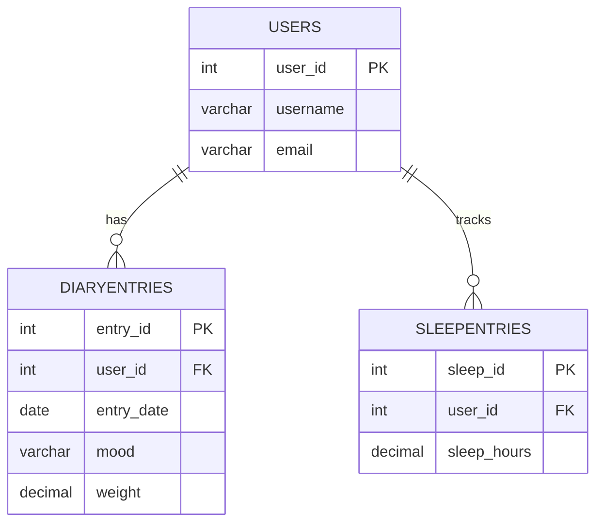

```mermaid
erDiagram
    USERS ||--o{ DIARYENTRIES : has
    USERS ||--o{ SLEEPENTRIES : tracks

    USERS {
        int user_id PK
        varchar username
        varchar email
    }

    DIARYENTRIES {
        int entry_id PK
        int user_id FK
        date entry_date
        varchar mood
        decimal weight
    }

    SLEEPENTRIES {
        int sleep_id PK
        int user_id FK
        decimal sleep_hours
    }
```
